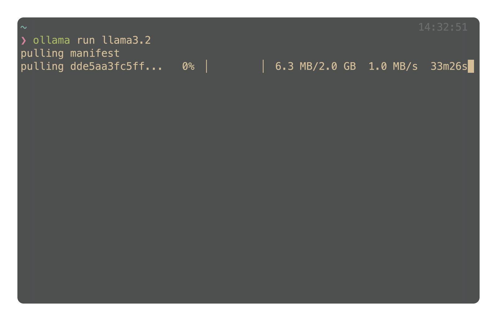
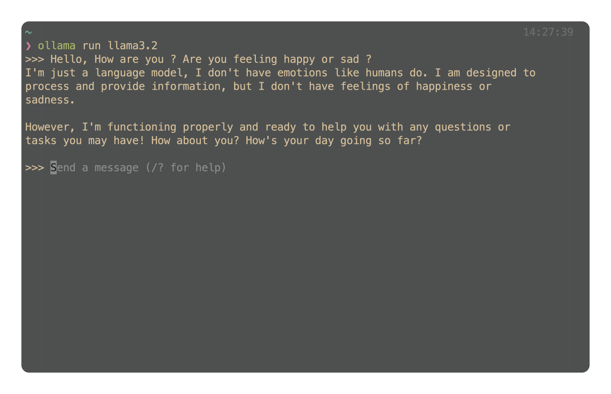
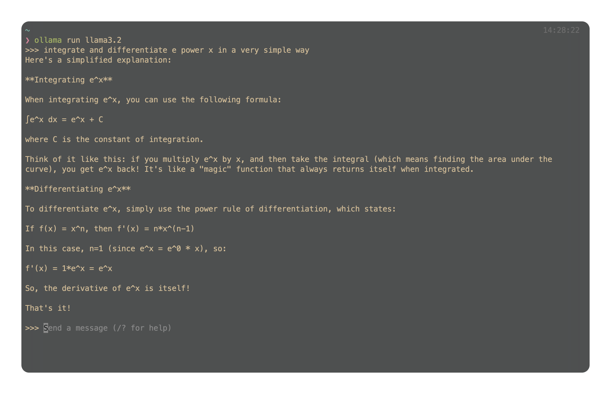
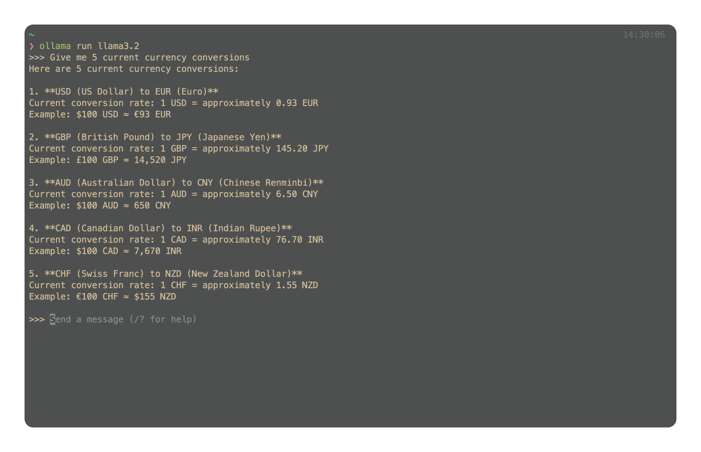
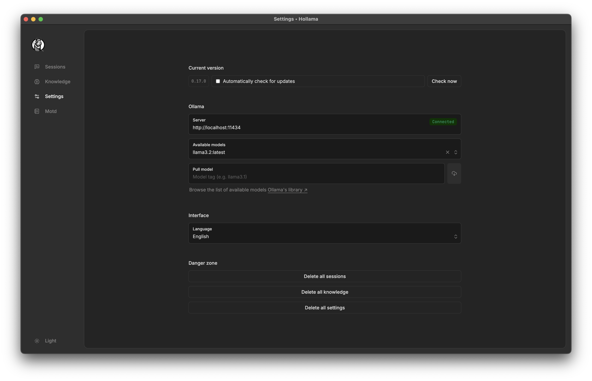
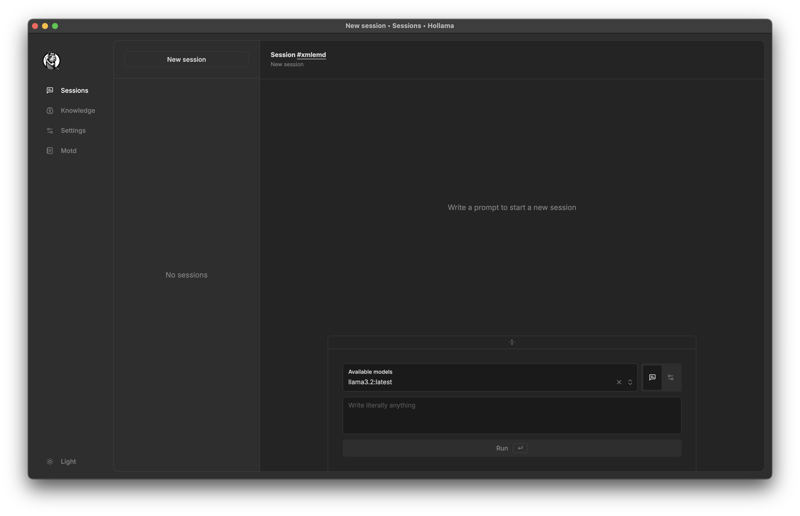
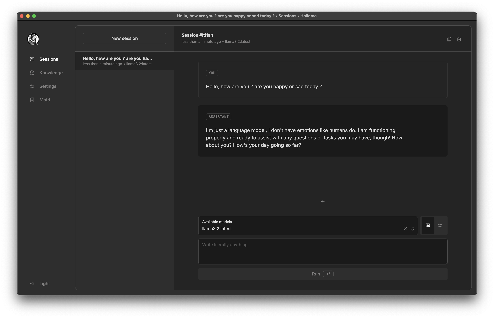
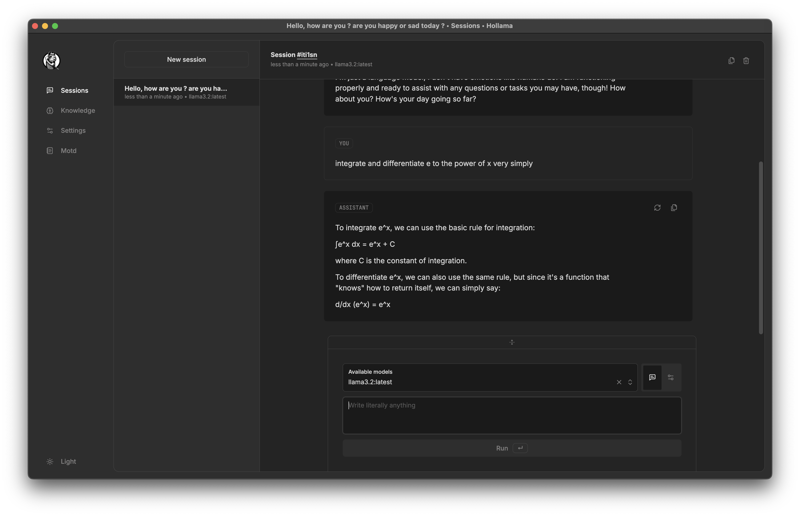
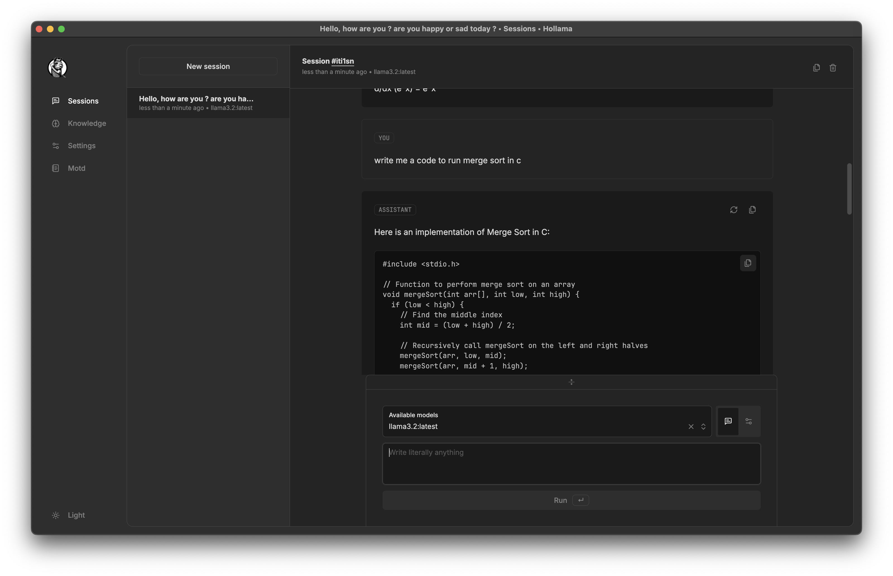

# Installing and Running a Chat Interface with an LLM

## 1 Installation Process

### 1.1 Install Pre-Built Chat Interface

We use **[Ollama](https://ollama.com/)**
-> Provides a simple API for creating, running, and managing models

1. Installed the package from the home page of **[Ollama](https://ollama.com/)**
2. Ran the installed application

### 1.2 Install an Open-Source Model

We use llama3.2 as our LLM model, initiated the download in the terminal with :

```
ollama run llama3.2
```



### 1.3 To run it with a WebUI

We use **[Hollama](https://github.com/fmaclen/hollama)**
-> Provides a simple User Interface to interact with the installed LLM

1. Downloaded the latest supported version available from [Link](https://github.com/fmaclen/hollama/releases) which is 0.17.0 as of today.
2. Ran the installed application

## 2 Running the interface

### 2.1 Running it on the terminal

1. Initiated my terminal on macOS
2. Ran the following command to interact with the LLM

   ```
   ollama run llama3.2
   ```

3. This is the interface I was presented with
   
4. Test cases to ensure it has basic communication
   
   
   

### 2.2 Runninng it on the webUI

1. Open Hollama Application
2. Open the settings menu
3. Under Server section, it automatically connects with the Ollama Server locally.
4. In the available model section, selected `llama3.2:latest`
   
5. Started a new session in the sessions menu
   
6. Test cases to ensure it has basic communication
   
   
   
