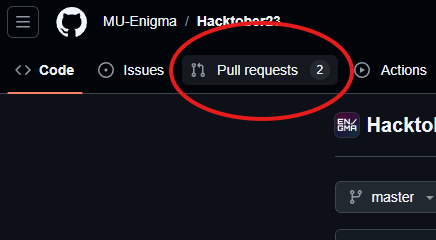

# Hacktoberfest 2024 Repository


# Hacktoberfest24

Welcome to **Hacktoberfest24**, an initiative by **Enigma** to consolidate all of Enigma's repositories that are open for Hacktoberfest contributions. This effort brings together projects across various themes under one platform, making it easier for contributors to identify and participate in **Hacktoberfest-approved** repositories. Whether you're a designer, developer, or enthusiast, you'll find challenges that suit your skill level, and you can contribute to meaningful projects while gaining hands-on experience and building your portfolio.

---

## Table of Contents

- [Hacktober24 session presentation](Hacktober2k24.pdf)
- [Repos and Themes  Overview](#repos-and-themes-overview)
  - Enigma-SysCom-Challenges (Computer Systems Development) ([https://github.com/MU-Enigma/Enigma-SysCom-Challenges](https://github.com/MU-Enigma/Enigma-SysCom-Challenges))
  - Enigma-WebDev-Challenges (Web Development) ([https://github.com/MU-Enigma/Enigma-WebDev-Challenges/](https://github.com/MU-Enigma/Enigma-WebDev-Challenges/))
  - Enigma-GenAI-Challenges (Generative AI) ([https://github.com/MU-Enigma/Enigma-GenAI-Challenges](https://github.com/MU-Enigma/Enigma-GenAI-Challenges))
  - Enigma-GameDev-Challenges ([https://github.com/MU-Enigma/Enigma-GameDev-Challenges/](https://github.com/MU-Enigma/Enigma-GameDev-Challenges/))
  - BotForge (Bots, NLP, and LLaMA Models related Devlopment) ([https://github.com/MU-Enigma/BotForge](https://github.com/MU-Enigma/BotForge))
- [Submission Guidelines](#general-guide-for-contribution)
- [Repository Do's and Don'ts](#repository-dos-and-donts)
- [Resources](#resources)
- [License](#license)

---

### Important:

- **Refer to the README** under each Repository's folder for a more detailed description of each level and specific instructions for submitting your contribution.
- **Each problem must have only one pull request.** Do not combine multiple solutions into a single PR, as it will be rejected.

---

## Repos and Themes Overview 

Each repository contains 4 levels of increasing complexity. Each level offers a unique challenge that aligns with the theme, allowing contributors to progressively build their skills and portfolio.

### Understanding Contribution Levels:
- **Level 0**: No code required; typically involves design, mockups, or documentation.
- **Level 1**: Low code; simple scripts or small features.
- **Level 2**: Medium code; more complex features or functionalities.
- **Level 3**: High code/mini projects; comprehensive projects or significant features.

---

### 1. [**Enigma-SysCom-Challenges (Computer Systems Development)**](https://github.com/MU-Enigma/Enigma-SysCom-Challenges)
- **Level 0**: Customize system environments.
- **Level 1**: Work with Docker to containerize applications.
- **Level 2**: Create custom shells.
- **Level 3**: Build your own version control system (a clone of Git or SVN).

---

### 2. [**Enigma-WebDev-Challenges (Web Development)**](https://github.com/MU-Enigma/Enigma-WebDev-Challenges/)
- **Level 0**: Design mockups for the Enigma website.
- **Level 1**: Implement an event calendar webpage for the Enigma website.
- **Level 2**: Implement blog posts into the Enigma website.
- **Level 3**: Redesign the Enigma website or create a personal portfolio website.

---

### 3. [**Enigma-GenAI-Challenges (Generative AI)**](https://github.com/MU-Enigma/Enigma-GenAI-Challenges)
- **Level 0**: Redesign logos with a spooky theme using GenAI.
- **Level 1**: Manipulate and fill in the missing parts of images.
- **Level 2**: Generate a spooky beat locally using AI tools.
- **Level 3**: Create poetry using AI techniques without using LLMs.

---

### 4. [**Game Development**](https://github.com/MU-Enigma/Enigma-GameDev-Challenges/)
- **Level 0**: Design and model a 3D chessboard using Godot and Blender.
- **Level 1**: Implement movement mechanics for chess pieces.
- **Level 2**: Add visual effects and textures to the chess game.
- **Level 3**: Build unique game mechanics or create additional levels to the game.

---

### 5. [**BotForge (Bots, NLP, and LLaMA Models related Devlopment)**](https://github.com/MU-Enigma/BotForge)
- **Level 0**: Develop prompts to convince AI of a false fact.
- **Level 1**: Fine-tune pre-trained models for specific NLP tasks.
- **Level 2**: Develop a chatbot that can handle domain-specific tasks.
- **Level 3**: Fine-tune a LLaMA model to perform a complex NLP task.

---

## General Guide for Contribution:

### 1. **Fork the Repository**
   - Navigate to the repository on GitHub.
   - Click the **Fork** button on the top right to create a copy of the repository under your GitHub account.
   - 


### 2. **Clone the Forked Repository to Your Local Machine**
   - Copy the URL of your forked repository (e.g., `https://github.com/<your_username>/Enigma-GenAI-Challenges`).
   - Open your terminal or command prompt and run the following command to clone the repo:
     ```bash
     git clone https://github.com/<your_username>/<repo_name>.git
     ```
   - Navigate into the project directory:
     ```bash
     cd <repo_name>
     ```

### 3. **Navigate to the Corresponding Level/Task Directory**
   - Based on the task you're contributing to, navigate to the appropriate directory. For example:
     ```bash
     cd Level1/  # or Level0/, Level2/, etc.
     ```

### 4. **Create a Folder Named After Your GitHub Username**
   - Inside the specific task directory, create a folder named after your GitHub username to organize your submission:
     ```bash
     mkdir <your_username>
     ```

### 5. **Add Your Contribution**
   - Inside your folder, add all the files relevant to your submission:
     - Generated images, code, audio files, etc., depending on the task.
     - Create a text file to provide information such as:
       - Tools or AI models used.
       - Prompts or methodologies applied.
       - Any additional required details as specified by the task.

### 6. **Stage Your Changes**
   - After adding all necessary files, use `git` to stage the changes:
     ```bash
     git add .
     ```

### 7. **Commit Your Changes**
   - Commit the changes with a descriptive message about your contribution:
     ```bash
     git commit -m "Added contribution for Level<X> : <task_name> by <your_username>"
     ```

### 8. **Push Your Changes to Your Forked Repository**
   - Push the changes to the `main` branch of your forked repository:
     ```bash
     git push origin main
     ```

### 9. **Open a Pull Request**



   - Navigate to the original repository on GitHub.
   - You’ll see a message prompting you to open a Pull Request (PR). Click on **Compare & pull request**.
   - Add a descriptive title and a comment explaining your contribution.
   - Submit the PR for review.

### 10. **Await Review:**
   - Maintainers will review your PR. They may request changes or approve it.
   - Engage respectfully and make necessary adjustments based on feedback.

### 11. **Celebrate Your Contribution:**
   - Once your PR is merged, you've successfully contributed to Hacktoberfest 2024!


### **Checklist Before Submitting a Pull Request**
- [ ] Have you forked and cloned the repository?
- [ ] Did you create a directory with your GitHub username?
- [ ] Did you include all necessary files for your contribution (images, audio, text files, etc.)?
- [ ] Did you specify tools, models, prompts, or methodologies in a text file?
- [ ] Did you push your changes to your forked repository?
- [ ] Have you opened a pull request with a descriptive title and comment?

---

By following this general procedure, contributors can efficiently submit their work for review, making it easier for maintainers to merge pull requests.

---

## Repository Do's and Don'ts

### Do's

- **Follow the Structure:** Organize your contributions under the correct theme and level directories.
- **Read the Guidelines:** Ensure you understand the requirements for each level before starting.
- **Write Clear Documentation:** Include `README.md` files that explain your work, how to run it, and any other pertinent details.
- **Use Meaningful Commit Messages:** Clearly describe what changes you've made.
- **Respect Licensing:** Ensure your contributions comply with the repository’s licensing terms.
- **Engage Positively:** Communicate respectfully with maintainers and other contributors.

### Don'ts

- **Don't Duplicate Efforts:** Check if a similar contribution already exists to avoid redundancy.
- **Don't Submit Incomplete Work:** Ensure your contribution meets the level’s requirements before submitting.
- **Avoid Large Binary Files:** Use appropriate formats and avoid uploading unnecessary large files.
- **Don't Ignore Feedback:** If maintainers request changes, address them promptly and courteously.
- **Avoid Offensive Content:** Ensure your submissions are professional and respectful.
- **No Plagiarism:** Ensure all your work is original and properly attribute any sources or inspirations.

---

## Resources

### General

- [Hacktoberfest Official Website](https://hacktoberfest.com/)
- [GitHub Forking Guide](https://docs.github.com/en/get-started/quickstart/fork-a-repo)
- [GitHub Pull Requests](https://docs.github.com/en/pull-requests)
- [Markdown Guide](https://www.markdownguide.org/)
- [Open Source Best Practices](https://opensource.guide/best-practices/)

---

## License

This repository is licensed under the [MIT License](LICENSE). Feel free to use, modify, and distribute the content as per the license terms.

---

Happy Hacking! 🚀

---
