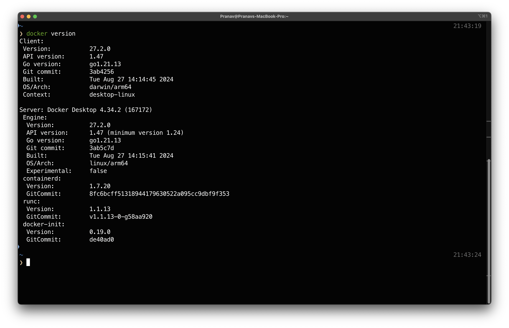

# Level 1 - Standard Hello World Docker

## 1 Downloading Docker

1. Download docker application for your respective OS from [Docker Website](https://www.docker.com).
2. Ran the installed application.


## 2 Running "hello-world" Docker

1. Checking the docker version to ensure its installed.



2. Ran the command

```
docker run hello-world
```


